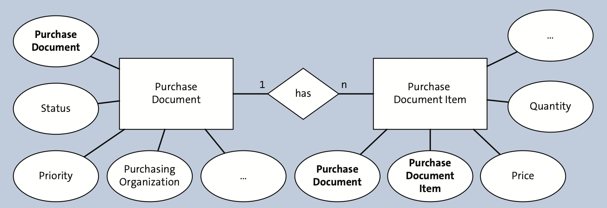

# ABAP RESTful Programming Model

A book by Stefen Hass and Bince Mathew.

## Part I - SAP S/4HANA and SAP Fiori

### 1 SAP S/4HANA Architecture

SAP S/4HANA is based on a completely different architecture optimized for SAP HANA. Nevertheless, a major goal of the SAP S/4HANA architecture is to stay as compatible as possible with previous SAP ERP releases to ease migration and to leverage existing, well-established, and proven business processes developed by SAP, partners, and customers in recent decades. 

A cornerstone of SAP S/4HANA is the VDM (Virtual Data Model) based on CDS (Core Data Services), which enables code pushdown to SAP HANA to a large extent according to the Code-to-Data paradigm. The VDM is the foundation of all application types in SAP S/4HANA, from transactional and analytical over to external interfaces and ESH. Explicitly released parts of the VDM can also be used by partners and customers as the foundation for developing custom applications. 

With SAP S/4HANA 1909 (released in September 2019), the ABAP RESTful programming model is now the recommended programming model for developing transactional SAP Fiori applications in SAP S/4HANA and supersedes the ABAP programming model for SAP Fiori. The renewed UX based on SAP Fiori is another big leap forward and will be discussed in detail in the next chapter.

### 2 SAP Fiori and the Design-Led Development Process

SAP Fiori works seamlessly across desktops, tablets, and mobile devices to enable users to work on the go. SAP Fiori is the new UX for SAP software, so developers will need to understand its design principles and guidelines to develop new apps. Following these design guidelines is important and will ensure that your apps look and feel just as good as the standard suite of apps SAP Fiori offers.

In this chapter, we laid out the basic design principles of all SAP Fiori apps, discussed responsive and adaptive design, and explained the SAP Fiori launchpad and its components.

Then, we looked at the design-led development process and the different phases that are crucial for an SAP Fiori project. We considered the different app types offered by SAP Fiori to help developers with app development.

Finally, we discussed the different prototyping tools to help create beautiful design sketches and interactive prototypes for your final product.

In the next chapter, you’ll learn about the ABAP RESTful programming model for SAP Fiori and its associated technologies.

### 3 ABAP RESTful Programming Model

In this chapter, we provided an overview of the ABAP RESTful programming model and its associated technologies. We started with CDS, which are at the center of all application development for SAP S/4HANA. CDS are the foundation for all application types and can be configured for different application types using domain-specific UIs, analytics, or search annotations. To turn a CDS data model into a transactional business object, new types of CDS associations are required to build a compositional hierarchy. 

Next, we looked at SAP Gateway and OData as technologies enabling easy network-based access to business data stored in SAP NetWeaver backend systems. Then, we turned to the ABAP RESTful programming model and explored how it supports the provision of model-based read and transactional access to CDS entities via OData. 

The ABAP RESTful programming model enhances the CDS data model with new, transportable ABAP repository objects for behavior modeling (behavior definition and implementation) and service provisioning (service definition and service binding), while also being a completely Eclipse-based E2E development experience. The ABAP REST-ful programming model is currently the state-of-the-art programming model for developing applications for the SAP S/4HANA platform.

## II Developing Applications for SAP S/4HANA

### 4 Developing an SAP Fiori Elements List Report and Object Page

The application design consists of a list report displaying purchase documents in a table and an object page providing detailed information for a purchase document, including its individual purchase document items, which can be granted using a quick action. Using this business scenario, this chapter will provide you with an E2E development guide for developing list report and object page applications based using the new ABAP RESTful programming model for SAP Fiori.

We’ll first create a set of basic, com- posite, and consumption CDS views along with the necessary UI annotations, and then we’ll take advantage of the service definition and service binding to register the OData service and expose the CDS view. Then, we’ll add the transactional behavior via the behavior definition.

In the second part, we’ll create a projection view (the `VDM type` is `Consumption`) on top of the composite view with the necessary transactional capabilities added to them via the behavior definition. This practice will allow us to reuse our business objects.

#### 4.2 Introduction to the Data Model

The first step to developing any app is the creation of a data model, followed by the creation of actual database tables for persisting transactional or master data.



##### Database Tables

New database tables can be cre- ated in Eclipse using a source code editor:
1. Open the ABAP perspective.
2. In the ABAP project, select the package node in which you want to create the table via the Project Explorer view.
3. Open the context menu by right-clicking on the package and selecting `New Other
ABAP Repository Object` → `Dictionary` → `Database Table`.
4. The database table creation wizard will open. You must enter a `Name` and `Description`. We’ll create a table for purchase documents called `ZNV_PURCHDOC` and a table for purchase document items called `ZNV_PURCHDOCITEM`.
5. The database table source code editor opens, where you can add fields to the table and configure its properties.

You can define technical as well as semantic attributes of the table with the help of annotations. For instance, with the `@EndUserText.label` annotation, you can provide meaningful and translatable labels and descriptions for objects and fields. For fields, this annotation will only be considered if the field has no data element assigned; otherwise, the field label is taken from the data element. For simplicity, we’ve only created a data element for the `purchasedocument` field (`znv_purchdocdtel`) since this data element is required for later referencing the field via a foreign key annotation in the purchase document items table. The other fields are typed using built-in ABAP types, like `abap.char(4)`.

Definition of `ZNV_PURCHDOC` table is given in the listing below:
```ABAP
@EndUserText.label : 'Purchase Document'
@AbapCatalog.enhancementCategory : #EXTENSIBLE_ANY
@AbapCatalog.tableCategory : #TRANSPARENT
@AbapCatalog.deliveryClass : #A
@AbapCatalog.dataMaintenance : #ALLOWED
define table znv_purchdoc {
  key client               : abap.clnt not null;
  key purchasedocument     : znv_purchdocdtel not null;
  @EndUserText.label : 'Description'
  description              : abap.sstring(128);
  @EndUserText.label : 'Approval Status'
  status                   : abap.char(1);
  @EndUserText.label : 'Priority'
  priority                 : abap.char(1);
  @EndUserText.label : 'Purchasing Organisation'
  purchasingorganisation   : abap.char(4);
  @EndUserText.label : 'Purchase Document Image URL'
  purchasedocumentimageurl : abap.sstring(255);
  crea_date_time           : timestampl;
  crea_uname               : uname;
  lchg_date_time           : timestampl;
  lchg_uname               : uname;
}
```

In contrast to the purchase documents table, the database table definition has a compound primary key consisting of the `purchasedocumentitem` ID and the `purchasedocument` ID. Purchase document items and purchase documents tables are connected via a foreign key relationship on the `purchasedocument` ID field. The table contains fields for the price of an item and the quantity to purchase as well as fields for the corresponding currency and unit of measure. Those fields are connected using semantic annotations: `@Semantics.amount.currencyCode` for monetary values and `@Semantics.quantity.unitOfMeasure` for quantities.

The database table definition for purchase document items is given below:
```ABAP
@EndUserText.label : 'Purchase Document Item'
@AbapCatalog.enhancement.category : #EXTENSIBLE_ANY
@AbapCatalog.tableCategory : #TRANSPARENT
@AbapCatalog.deliveryClass : #A
@AbapCatalog.dataMaintenance : #ALLOWED
define table znv_purchdocitem {
  key client                   : abap.clnt not null;
  key purchaseddocumentitem    : abap.char(10) not null;
  @AbapCatalog.foreignKey.keyType : #KEY
  @AbapCatalog.foreignKey.screenCheck : true
  key purchasedocument         : znv_purchdocdtel not null
    with foreign key [1..*,1] znv_purchdoc
      where client = znv_purchdocitem.client
        and purchasedocument = znv_purchdocitem.purchasedocument;
  @EndUserText.label : 'Description'
  description                  : abap.sstring(128);
  @EndUserText.label : 'Price'
  @Semantics.amount.currencyCode : 'znv_purchdocitem.currency'
  price                        : abap.curr(13,2);
  @EndUserText.label : 'Currency'
  currency                     : abap.cuky;
  @EndUserText.label : 'Quantity'
  @Semantics.quantity.unitOfMeasure : 'znv_purchdocitem.quantityunit'
  quantity                     : abap.quan(13,2);
  @EndUserText.label : 'Unit'
  quantityunit                 : abap.unit(3);
  @EndUserText.label : 'Vendor'
  vendor                       : abap.sstring(32);
  @EndUserText.label : 'Vendor Type'
  vendortype                   : abap.sstring(32);
  @EndUserText.label : 'Purchase Document Item Image URL'
  purchasedocumentitemimageurl : abap.sstring(255);
  crea_date_time               : timestampl;
  crea_uname                   : uname;
  lchg_date_time               : timestampl;
  lchg_uname                   : uname;
}
```

#### 4.1.3 Creating Basic Interface Core Data Services Views

text
